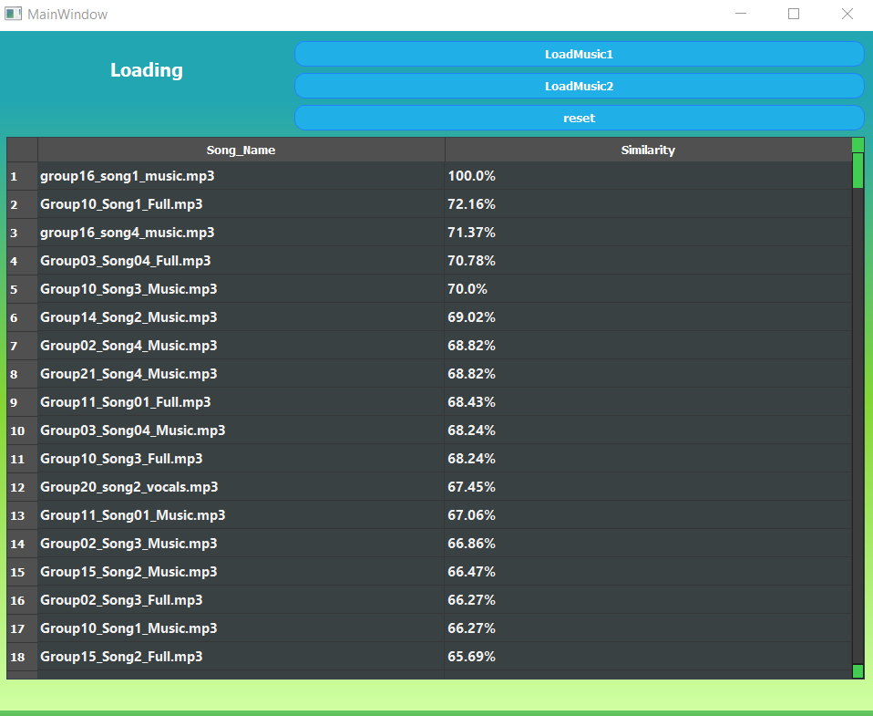
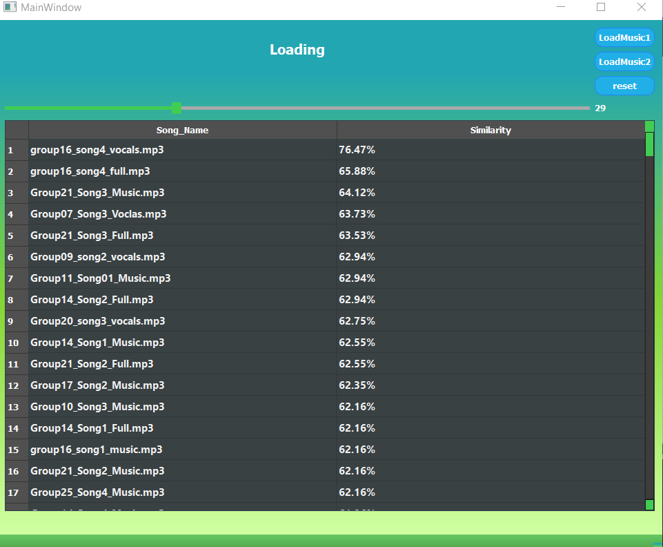

# voice-fingerprint-detector 
## description
-is basically to identify a signal based on a short sample for it which usually has its intrinsic features and thus these intrinsic features penalized.
## Features
- used to get all percentage for all musics in the database   
- pop up spectrogram for this signal
- music features used
        **1-** mfcc:MFCC coefficients are used to represent the shape of the spectrum.
       **2-** chroma:Compute a chromagram from a waveform or power spectrogram.
       **3-** melspectrogram : spectrum of intensity of sound
- mixer of 2 songs with slider on uploading two musics
## python_packages  :
- PyQt5.QtWidgets
- PyQt5.uic
- operator
- imagehash
- librosa
- PIL

## screenshots:

